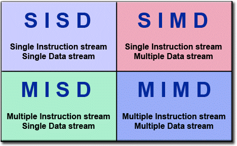
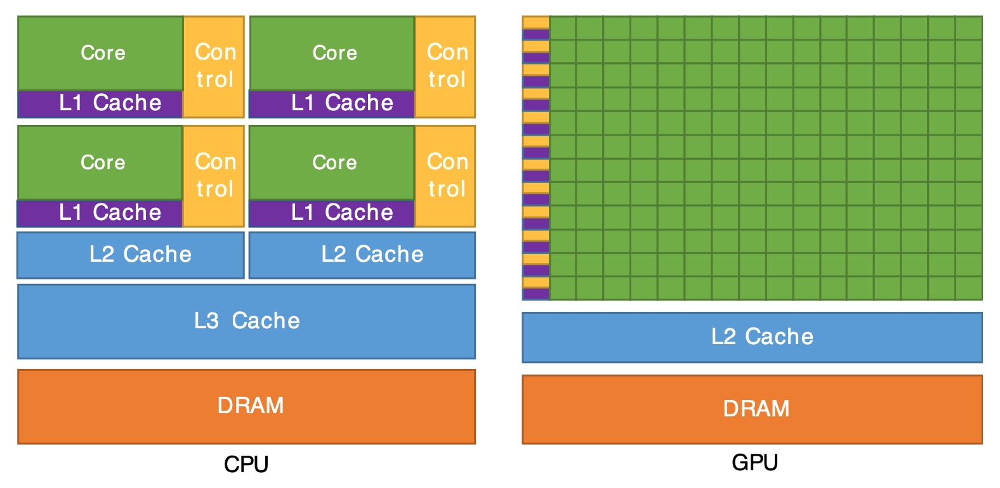
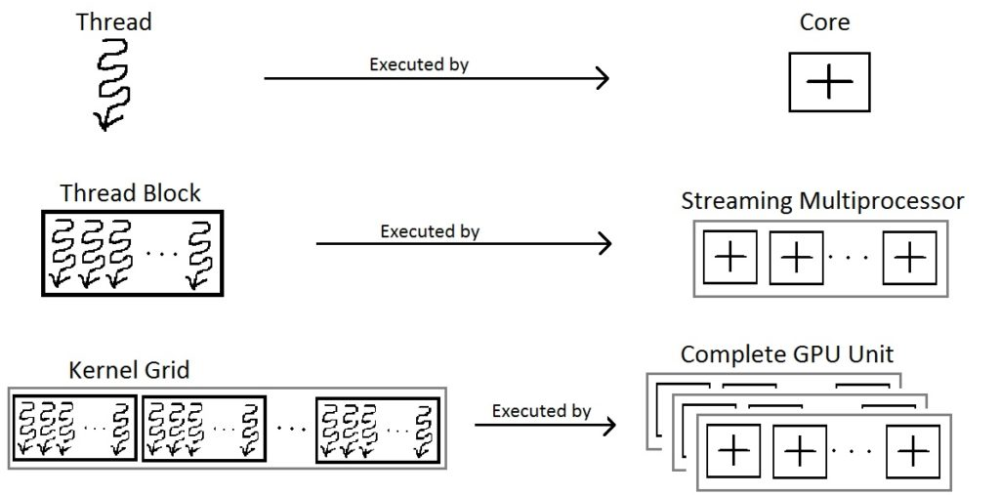
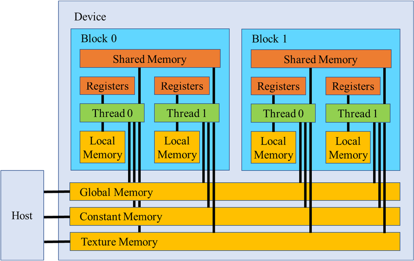

# Parallel Computing Notes & CUDA 
By Maria Tzevelekou 

### Table of Contents 
1. Introduction
1. GPU Architecture and an Introduction to Parallel Programming
1. 


## Introduction 

HPC (also known as High-performance Computing) is a way to perform complicated computations with large volumes of data. Supercomputers are the ones that are used to execute said operations, via parallel processing. This way, a task is broken into smaller sub-tasks and those are executed simultaneously; thus, usually, the time taken for a process is much faster than normal (as seen in serial execution).  

By making the execution time faster (*), HPC systems can be utilized in applications that are used every day. Think of it like this: how would we know what the weather would be like tomorrow, if the computation would take a day and a half? 

Aside from the weather, HPCs can be used in machine learning applications (like training ChatGPT), drug simulations and modelling their chemical interactions, fluid dynamics, astrophysics, electromagnetism and many more [1]. It’s a tool used by scientists worldwide aiding their computations and research, helping all areas of technology progress.  


<mark> do i add abt moores law going RIP which is why we need this or noooooo </mark>

The top 500 supercomputers can be found in the following list that gets published every year: https://top500.org/lists/top500/ . 

The current ones are the following:  

<mark> insert photo </mark>  

These supercomputers all have CPUs (Central Processing Units) and GPUs (Graphics Processing Units) in them, in which parallel processing is done. This series of notes will focus on parallel programming in GPUs, specifically using CUDA (Computer Unified Device Architecture) with C/C++. The intended audience is people that are interested in parallel computing and have knowledge of C/C++, rudimentary linear algebra operations, graph algorithms and computer architecture.  

These notes are based on the book Programming Massively Parallel Processors by David Kirk and Wen-mei Hwu, and the course Parallel Processing at NTUA <mark> stanford course ?????? </mark>. The aim is to introduce CUDA in a beginner-friendly manner, along with the main concepts of parallel computing in GPUs. The notes will cover the following topics: 

- An introduction to parallel programming  

- GPU architecture

- Writing and compiling your first CUDA program  

- Parallelizing for-loops and adding vectors in CUDA 

- Race conditions and atomic operations  

- <mark> Another example ***  

- Warps and performance  

- Some more memory considerations  

- <mark> *** last example  

- <mark> ** example ideas- mat mult / vector add/ bfs // convolution maybe ???/// </mark>

<mark> maybe disclaimer how this is based on the scirouter systems cos i have no idea where else u could run this </mark>

***Please note: the following two sections (intro to parallel programming and GPU architecture) are more theoretical and if you know them you can skip them (but maybe skim them to be sure :P )*** 

(*) Beware: faster does NOT mean more efficient; performance, convenience, and cost are all taken into consideration when designing a parallel program.

## Introduction to Parallel Programming 

**Aim** : To understand basic parallel programming principles such as: 

- task, and data parallelism 
- race conditions, and synchronization 
- speedup, and Amdahl's law
- bottlenecks

We know that parallel programming is a method of computing by taking a large task (most likely time-intensive), and breaking it into smaller ones that can be done at the same time. It's mainly a way of decomposing a problem, and making it more efficient by seeing which parts can run concurrently. 

First, lets see in which ways we can do that- with some real-life examples. 

Let's start with **task parallelism**; it's the simultaneous execution of different tasks independent of each other. For example, pretend you are at a restaurant, ordering a burger. The server sends your order over to the kitchen and the task parallelism begins! Instead of waiting for the burger to _finish_ cooking, so that your fries can _start_ cooking, it's all done at the same time. The cook on the grill is flipping your burgers and buns, while someone else is cutting the onions (whilst possibly crying), and the fries are almost done on the other side of the kitchen-- all coming together in the end. So, your food stays hot, and you don't have to wait hours for a burger. 

**Data parallelism** on the other hand is when the same task is done on subdivisions of the same dataset. It is similar to completing a puzzle with your friends; you all have the same task, but each person has a different piece of data (ie. area of the puzzle). 

This all relates to **Flynn's taxonomy** as seen below [2]:




SISD: Serial programming, similar to the computer (or phone/tablet) that you are reading this from 

SIMD: Data parallelism 

MISD: Not really used, except for scenarios where reliability is absolutely necessary (like nuclear reactors)

MIMD: Task parallelism

---- 

Another main idea is **race conditions**, which cause inaccurate results and programs to crash. All of these parallel ways of thinking do have some pitfalls too. 

A real-life example is the task of grabbing a pen, and writing one's name with it on a piece of paper. If that task is assigned to only one person (say, Rasputin), we can make sure that Rasputin's name will be the one we will see. But what if now two people- Rasputin and Czar Nicholas have the same task- what name will we see now? Or will chaos ensue? We can't be certain--neither of our result, nor of how accurate it will be. However, if the task given to the two of them was to just look at the pen, we would know the outcome would be the same- since nothing about the pen, or our paper, would have changed. 


We can therefore conclude that simultaneous writes create race conditions, while reads do not. 

**Synchronization** is another way to mitigate problems arising from parallel programming techniques, such as race conditions. If in the above example Rasputin went first, then the Czar (or vice-versa), we could make sure we had names on our paper, without any chaos. 


<mark> is this confusing? </mark>

--- 
Transitioning to the math side of parallel programming, there is a way to measure how well the parallelization actually works- speedup. 


The **speedup** of a parallel program can be expressed as:

$$
\text{Speedup} = \frac{\text{Time}_{\text{sequential}}}{\text{Time}_{\text{parallel}}}
$$

with the time meaning the time taken to execute each program, respectively. 

Furthermore, **Amdahl's law** states that there is a limit to how fast a parallel program can be compared to its serial counterpart, which can be described with the equation below:

$$
\text{Speedup} = \frac{1}{(1 - P) + \frac{P}{N}}
$$

Where:
- P is the proportion of the program that can be parallelized.
- N is the increase in speed for the part of the task that gets better because of improved system resources (ie. more people in aforementioned parallelized tasks).  
- 1 - P is the portion of the program that remains sequential and cannot be parallelized.
[3]
--------


Sometimes, the speedup of a program may be unexpected (in a bad way), and many times this is the case because **bottlenecks** arise. 


This happens because of the nature of parallel programming; some tasks may require more work than others and take more time, or can't be parallelized at all. Synchronization also takes more time. Data may need to be accessed simultaneously, and the bandwidth of a system may not be sufficient enough to support it. Sometimes, certain algorithms just aren't built to be parallelized and have to be changed to do so. 


<mark> maybe they weren't born this way right track baby i was born this way </mark>
<mark> lady gaga parallel algorithm era? </mark>
<mark> na grapsw gia NUMA UMA klp i mpa </mark>


<mark> vasika na kanw conclusion??? </mark>

## GPU Architecture

**Aim** : To learn what a GPU is, and its architecture, along with the meanings of:

- kernel
- threads
- blocks

A GPU is a piece of hardware similar to a CPU, and was originally designed for video games, in order for their graphics to load. Coincidentally, they were found to be useful in areas other than gaming- such as parallel computing. They are perfect for running **embrassingly parallel** algorithms, such as applying a grayscale filter to an image- a task requiring little to no synchronization and can be done in a very easy, efficient, parallel manner. This is all due to how their hardware is designed, as seen here [4]: 


 

Let's analyze the above image a bit further. 

What are the first things that you notice?

On the right, you can see many more smaller green boxes than the left; that's because GPUs have many more **cores** than CPUs do. But these cores are not as powerful as the ones in a CPU- they are optimized for throughput (as seen by the small caches too). A GPU breaks down a task, executing it in parallel into its many cores. It is also important to note that each core has SIMD execution. 


Essentially, back to the restaurant example- the CPU is the head chef that has to organize everyone and all of the dishes on the menu (more complex operation), while the GPU is the line cook that is flipping 100 burgers in one minute (simpler operation, with a higher throughput).

----

In CUDA, each task is broken into smaller ones: those are organized in threads, blocks, and warps- all within the grid. 

 [5]

A **thread** is the smallest unit of execution in a GPU- ie. it can render a single pixel in an image. Each one has its own ID number to identify it- and it can be three-dimensional. It can have private memory. The ID number for a one-dimensional thread in CUDA is the following:

```C++
int i = threadIdx.x;  //ID of thread
```
A **block** or a group of threads is executed by an SM (or Streaming Multiprocessor) in the GPU, meaning many cores. Memory can be shared within a block. The syntax for a block ID is the following, and similarly has three dimensions:

```C++
int i = blockIdx.x;  //ID of block 
// But there is also a block dimension such as 
blockDim.x = 16;
blockDim.y = 16; 
// which would create a block of 16 threads across and 16 threads down, if we wanted to use it in a 2D data structure, such as an image.  
```
A **warp** is a group of 32 threads in a block. Each thread block is divided into warps, where the same instruction is executed (SIMD) -- you won't need to know much about this right now, but it's good to have an idea of how it works for the future. 

Lastly, the **grid** is where the thread blocks "live" on the GPU. In addition, the **kernel** is the function that runs on the GPU; it can be defined using  \_\_global\_\_, and invoked with <<<...>>>. The invocation can take parameters such as <<< number of blocks in the program, number of threads per block >>>, which can be defined by the programmer. 

Below is an example of vector addition, illustrating the previous ideas:

```C++
// Define the kernel
__global__ void vec_add(float* A, float* B, float* C)
{
    int i = threadIdx.x;
    C[i] = A[i] + B[i];
}

int main()
{
    ...
    // Kernel invocation with arbitrary blocks and threads
    vec_add<<<num_of_blocks, num_of_threads>>>(A, B, C);
    ...
}
```
Below, we can see the different memory arrangements that exists in the GPU: 

 [6]

The device memory in the image above is in our GPU, while the host memory is on the CPU. 

Each block can have its own shared memory between threads, as mentioned, while each thread can have its own local memory- **global memory** is shared amongst all blocks, **constant memory** is read-only that remains constant, and **texture memory** is also read-only that is used for spatial locality and graphics (such as in 2D images). 


### Summary 

A GPU is a highly parallel processing unit; in CUDA programming, tasks are divided into **threads**, grouped into **blocks**, and organized within a **grid**. Threads within a block can share shared memory and are executed on Streaming Multiprocessors (SMs). The **kernel** is a function running on the GPU, processing data in parallel, and can be invoked with <<< ... >>>. Different memory types, such as **global**, **shared**, **constant**, and **texture** memory, optimize performance based on access patterns.


## Writing Your First Program (yay!!!)
**Aim** : To see and then implement a CUDA program on your own.

>#### Environment 
nvcc

>#### Compilation


First program -  

Hello world  


show vector addition example  

Do matrix multiplication 
 


___ 

 

 

 

 

 

 

## Bibliography 

[1] https://www.nvidia.com/en-eu/glossary/high-performance-computing/ 

[2] https://www.researchgate.net/figure/Flynns-taxonomy-matrix-In-parallel-programming-there-are-two-types-of-memory-model-as_fig1_338160092

[3] https://en.wikipedia.org/wiki/Amdahl%27s_law

[4] https://cvw.cac.cornell.edu/gpu-architecture/gpu-characteristics/ArchCPUGPUcores.png

[5] http://thebeardsage.com/cuda-streaming-multiprocessors/

[6] https://www.researchgate.net/publication/331453189/figure/fig6/AS:960232402464789@1605948653309/CUDA-hierarchical-memory-model-device-GPU-can-communicate-with-host-CPU-through.png

