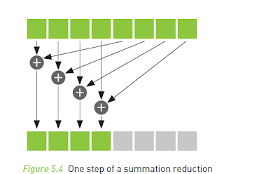
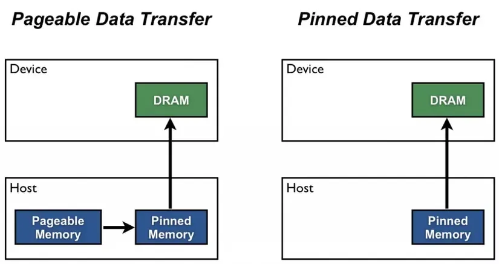

# Parallel Computing Notes & CUDA 
By Maria Tzevelekou 

### Table of Contents 
1. Introduction
1. An Introduction to Parallel Programming
1. GPU Architecture
1. Writing Your First Program in CUDA
1. Vector Addition in CUDA
1. Matrix Multiplication in CUDA and Measuring Speedup
1. A Sum Computation and Synchronization 
1. Parallelized BFS
1. Streams and Pinned Memory with Vector Addition
1. Summary


## Introduction 

HPC (also known as High-performance Computing) is a way to perform complicated computations with large volumes of data. Supercomputers are the ones that are used to execute said operations, via parallel processing. This way, a task is broken into smaller sub-tasks and those are executed simultaneously; thus, usually, the time taken for a process is much faster than normal (as seen in serial execution).  

By making the execution time faster (*), HPC systems can be utilized in applications that are used every day. Think of it like this: how would we know what the weather would be like tomorrow, if the computation would take a day and a half? 

Aside from the weather, HPCs can be used in machine learning applications (like training ChatGPT), drug simulations and modelling their chemical interactions, fluid dynamics, astrophysics, electromagnetism and many more [1]. It’s a tool used by scientists worldwide aiding their computations and research, helping all areas of technology progress.  


The top 500 supercomputers can be found in the following list that gets published every year: https://top500.org/lists/top500/ . 


These supercomputers all have CPUs (Central Processing Units) and GPUs (Graphics Processing Units) in them, in which parallel processing is done. This series of notes will focus on parallel programming in GPUs, specifically using CUDA (Computer Unified Device Architecture) with C/C++. The intended audience is people that are interested in parallel computing and have knowledge of C/C++, rudimentary linear algebra operations, graph algorithms and computer architecture.  

These notes are based on the book Programming Massively Parallel Processors by David Kirk and Wen-mei Hwu [12], the course Parallel Processing at NTUA [13], the CUDA by Example book by Jason Sanders and Edward Kandrot [14], the Stanford CS149 course [15], and the CUDA Programming Guide by NVIDIA [16]. The aim is to introduce CUDA in a beginner-friendly manner, along with the main concepts of parallel computing in GPUs. The notes will cover the following topics: 

-  An Introduction to Parallel Programming
-  GPU Architecture
-  Writing Your First Program in CUDA
-  Vector Addition in CUDA
-  Matrix Multiplication in CUDA and Measuring Speedup
-  A Sum Computation and Synchronization 
-  Parallelized BFS
-  Streams and Pinned Memory with Vector Addition
-  Summary


***Please note: the following two sections are theory-based, rather than showing code examples.*** 

(*) Beware: faster does not mean more efficient; performance, convenience, and cost are all taken into consideration when designing a parallel program.

## Introduction to Parallel Programming 

**Aim** : To understand basic parallel programming principles such as: 

- task, and data parallelism 
- race conditions, and synchronization 
- speedup, and Amdahl's law
- bottlenecks

We know that parallel programming is a method of computing by taking a large task (most likely time-intensive), and breaking it into smaller ones that can be done at the same time. It's mainly a way of decomposing a problem, and making it more efficient by seeing which parts can run concurrently. 

First, lets see in which ways we can do that- with some real-life examples. 

Let's start with **task parallelism**; it's the simultaneous execution of different tasks independent of each other. For example, pretend you are at a restaurant, ordering a burger. The server sends your order over to the kitchen and the task parallelism begins! Instead of waiting for the burger to _finish_ cooking, so that your fries can _start_ cooking, it's all done at the same time. The cook on the grill is flipping your burgers and buns, while someone else is cutting the onions (whilst possibly crying), and the fries are almost done on the other side of the kitchen-- all coming together in the end. So, your food stays hot, and you don't have to wait hours for a burger. 

**Data parallelism** on the other hand is when the same task is done on subdivisions of the same dataset. It is similar to completing a puzzle with your friends; you all have the same task, but each person has a different piece of data (ie. area of the puzzle). 

This all relates to **Flynn's taxonomy** as seen below [2]:


SISD: Serial programming, similar to the computer (or phone/tablet) that you are reading this from 

SIMD: Data parallelism 

MISD: Not really used, except for scenarios where reliability is absolutely necessary (like nuclear reactors)

MIMD: Task parallelism

---- 

Another main idea is **race conditions**, which cause inaccurate results and programs to crash. All of these parallel ways of thinking do have some pitfalls too. 

A real-life example is the task of grabbing a pen, and writing one's name with it on a piece of paper. If that task is assigned to only one person (say, Rasputin), we can make sure that Rasputin's name will be the one we will see. But what if now two people- Rasputin and Czar Nicholas have the same task- what name will we see now? Or will chaos ensue? We can't be certain--neither of our result, nor of how accurate it will be. However, if the task given to the two of them was to just look at the pen, we would know the outcome would be the same- since nothing about the pen, or our paper, would have changed. 


We can therefore conclude that simultaneous writes will create race conditions, while reads do not, because we are changing data (the name) in our memory (the paper).

**Synchronization** is another way to mitigate problems arising from parallel programming techniques, such as race conditions. If in the above example Rasputin went first, then the Czar (or vice-versa), we could make sure we had names on our paper, without any chaos. 

--- 
Transitioning to the math side of parallel programming, there is a way to measure how well the parallelization actually works- speedup. 


The **speedup** of a parallel program can be expressed as:

$$
\text{Speedup} = \frac{\text{Time}_{\text{sequential}}}{\text{Time}_{\text{parallel}}}
$$

with the time meaning the time taken to execute each program, respectively. 

Furthermore, **Amdahl's law** states that there is a limit to how fast a parallel program can be compared to its serial counterpart, which can be described with the equation below:

$$
\text{Speedup} = \frac{1}{(1 - P) + \frac{P}{N}}
$$

Where:
- P is the proportion of the program that can be parallelized.
- N is the increase in speed for the part of the task that gets better because of improved system resources (ie. more people in aforementioned parallelized tasks).  
- 1 - P is the portion of the program that remains sequential and cannot be parallelized[3].
--------


Sometimes, the speedup of a program may be unexpected (in a bad way), and many times this is the case because **bottlenecks** arise. 


This happens because of the nature of parallel programming; some tasks may require more work than others and take more time, or can't be parallelized at all. Synchronization also takes more time. Data may need to be accessed simultaneously, and the bandwidth of a system may not be sufficient enough to support so many data reads/writes. Sometimes, certain algorithms just aren't built to be parallelized and have to be changed to do so. 


## GPU Architecture

**Aim** : To learn what a GPU is, and its architecture, along with the meanings of:

- kernel
- threads
- blocks

A GPU is a piece of hardware similar to a CPU, and was originally designed for video games, in order for their graphics to load. Coincidentally, they were found to be useful in areas other than gaming- such as parallel computing. They are perfect for running **embarrassingly parallel** algorithms, such as applying a gray scale filter to an image- a task requiring little to no synchronization and can be done in a very easy, efficient, parallel manner. This is all due to how their hardware is designed, as seen here [4]: 


 

Let's analyze the above image a bit further. 

What are the first things that you notice?

On the right, you can see many more smaller green boxes than the left; that's because GPUs have many more **cores** than CPUs do. But these cores are not as powerful as the ones in a CPU- they are optimized for throughput (as seen by the small caches too). A GPU breaks down a task, executing it in parallel into its many cores. It is also important to note that each core has SIMD execution. 


Essentially, back to the restaurant example- the CPU is the head chef that has to organize everyone and all of the dishes on the menu (more complex operation), while the GPU is the line cook that is flipping 100 burgers in one minute (simpler operation, with a higher throughput).

----

In CUDA, each task is broken into smaller ones: those are organized in threads, blocks, and warps- all within the grid [5]. 

 

A **thread** is the smallest unit of execution in a GPU- ie. it can render a single pixel in an image. Each one has its own ID number to identify it- and it can be three-dimensional. It can have private memory. The ID number for a one-dimensional thread in CUDA is the following:

```C++
int i = threadIdx.x;  //ID of thread
```
A **block** or a group of threads is executed by an SM (or Streaming Multiprocessor) in the GPU, meaning many cores. Memory can be shared within a block. The syntax for a block ID is the following, and similarly has three dimensions:

```C++
int i = blockIdx.x;  //ID of block 
// But there is also a block dimension such as 
blockDim.x = 16;
blockDim.y = 16; 
// which would create a block of 16 threads across and 16 threads down,
// if we wanted to use it in a 2D data structure, such as an image.  
```
A **warp** is a group of 32 threads in a block. Each thread block is divided into warps, where the same instruction is executed (SIMD) -- you won't need to know much about this right now, but it's good to have an idea of how it works for the future. 

Lastly, the **grid** is where the thread blocks "live" on the GPU. Similarly to blocks, the grid dimension is given by:
```C++
int i = gridDim.x; // Grid dimension in the x axis
``` 

In addition, the **kernel** is the function that runs on the GPU; it can be defined using  \_\_global\_\_, and invoked with <<<...>>>. The invocation can take parameters such as: <<< number of blocks in the program, number of threads per block >>>, which can be defined by the programmer. 

Below is an example of vector addition, illustrating the previous ideas:

```C++
// Define the kernel
__global__ void vec_add(float* A, float* B, float* C)
{
    int i = threadIdx.x;
    C[i] = A[i] + B[i];
}

int main()
{
    ...
    // Kernel invocation with arbitrary number of blocks and threads
    int num_of_blocks = 1; 
    int num_of_threads_per_block = 1; 
    vec_add<<<num_of_blocks, num_of_threads_per_block>>>(A, B, C);
    ...
}
```
Please note: usually blocks and threads are in powers of 2 for easier computation. They are also always positive integers. 

Below, we can see the different memory arrangements that exists in the GPU [6]: 

 

The device memory in the image above is in our GPU, while the host memory is on the CPU. 

There are two other declarations of a function that can be made- `__host__ ` and ` __device__ `, each one executed and called by the host and the device respectively. 

Each block can have its own shared memory between threads, as mentioned, while each thread can have its own local memory- **global memory** is shared amongst all blocks, **constant memory** is read-only that remains constant, and **texture memory** is also read-only that is used for spatial locality and graphics (such as in 2D images). 

Similar to the `__global__ `, `__host__`, and `__device__` attributes, the `__device__` ,  `__shared__` and `__constant__` attributes can be used in front of variables to declare where they should live within the memory of the GPU. 

**\_\_device\_\_** - a variable that lives in the global memory of the device (slower to access)  
> great for large datasets

 **\_\_shared\_\_** - a variable that lives in the shared memory of the blocks (faster to access, but limited within the threads of the block)
 > meant for cooperation between threads of a block


 **\_\_constant\_\_** - a variable in the read-only constant memory of the GPU that is faster to access since it is cached, but limited in size
> good for constant variables 


In short, a GPU is a highly parallel processing unit; in CUDA programming, tasks are divided into **threads**, grouped into **blocks**, and organized within a **grid**. Threads within a block can share shared memory and are executed on Streaming Multiprocessors (SMs). The **kernel** is a function running on the GPU, processing data in parallel, and can be invoked with <<< ... >>>. Different memory types, such as **global**, **shared**, **constant**, and **texture** memory, optimize performance based on access patterns.


## Writing Your First Program 
**Aim** : To see and then implement a CUDA program on your own.

>#### Environment and Compilation
First things first-setting up your environment. 

CUDA programs have a .cu extension, and are executed using the nvcc compiler. To run a CUDA program, you first need to set up the Makefile. 

Theoretically-since this course is based on the NTUA course- you can open up your terminal and connect to the Scirouter. If you can't, then maybe a quick google search can help you, or a google-colab notebook as to have a GPU available. For the purposes of these notes however, this is what we will refer to. 

For compiling the program you can make a file called Makefile with the following:

```bash 
usr/local/cuda-12.1/bin/nvcc  your_program.cu -O3 -lstdc++ -o your_program.out

#O3 are the compiler optimizations
```
Replacing your_program with the name of your program. 

In order for the program to compile you can use one of the machines that you have access to in the interactive mode, with the flag -I (but be certain to exit it, once you are done).

Before compiling, make sure to execute the command:
```
export CUDA_VISIBLE_DEVICES=1
```

So that CUDA can run on a GPU. 

>#### Hello World in CUDA

Let's start by creating a "hello world"!

Create a file in your chosen code editor called
```  
hello.cu
```

Then, let's think of how we would do this as a serial program in C. 

```C
#include <stdio.h> 

int main() {
    printf("Hello World from the CPU!\n"); 
    return 0; 
}
```
But what we want to do is to run this on a GPU. Let's add a kernel function by adding the global attribute. 


```C
#include <stdio.h> 

__global__ void hello_world() {
    printf("Hello World from the GPU!\n");
}

int main() {
    // what to do here?
    return 0; 
}
```
We now need to invoke the kernel- try playing around with the number of blocks and threads. Before you run this, how many hello's are you expecting to see? When you do run this, does it match your prediction?

```C
#include <stdio.h> 

__global__ void hello_world() {
    printf("Hello World from the GPU!\n");
    // try printf("Hello from thread %d\n", threadIdx.x); after you are done
}

int main() {
    printf("Hello World from the CPU!\n"); 

    //Launch the kernel with 1 block and 10 threads
    hello_world<<<1, 10>>>(); 

    //Wait for the GPU to finish before continuing on the CPU
    cudaDeviceSynchronize(); 
    return 0; 
}
```

So why did we add the following? 

```C
cudaDeviceSynchronize(); 
```
When a kernel is launched in a CUDA program, it is done so asynchronously- the CPU does not wait for the GPU to finish, as they are different pieces of hardware, so we need to add a "reminder" for it to do so. 


## Vector Addition in CUDA (and CudaMalloc)
**Aim:** To write a vector addition program in CUDA and understand how allocating memory works. 

Looking back at an initial example given before, let's try to write a vector addition program in CUDA. 

We can now take the previous program and fill in the blanks, but lets make some adjustments first.  
```C++
#include<iostream>
#include<stdlib.h>
// Define the kernel
__global__ void vec_add(float* A, float* B, float* C, int len)
{
    int i = threadIdx.x + blockIdx.x * blockDim.x;
    if (i < len)
    {
        C[i] = A[i] + B[i];
    }
}
```

Here, the variable `i` represents the global ID of each thread. Generally, this is a common pattern for for-loops in CUDA, using `i` as the global thread ID, as seen below. 

```C++
#include<iostream>
#include<stdlib.h>
// Define the kernel
__global__ void vec_add(float* A, float* B, float* C, int len)
{
    for (int i = threadIdx.x + blockdim.x*blockIdx.x; i<len; i+=blockDim.x * gridDim.x)
    {
        C[i] = A[i] + B[i];
    }
}
```
 Both of these have the same function, and will produce the same result. 


---

Now, let's move onto the main portion of the program, and allocating memory for the GPU. 


Starting, memory needs to be allocated for the host and for the GPU, along with the creation of the input data. 


```C++

int main(int argc, char **argv) {
    int inputLength = 1024;
    float *hostInput1, *hostInput2, *hostOutput, *expectedOutput;
    float *deviceInput1, *deviceInput2, *deviceOutput;

    hostInput1 = new float[inputLength];
    hostInput2 = new float[inputLength];
    hostOutput = new float[inputLength];
    expectedOutput = new float[inputLength];
       // Initialize the input data 
    for (int i = 0; i < inputLength; ++i) {
        hostInput1[i] = static_cast<float>(rand()) / RAND_MAX;  // Random values between 0 and 1
        hostInput2[i] = static_cast<float>(rand()) / RAND_MAX;  // Random values between 0 and 1
        expectedOutput[i] = hostInput1[i] + hostInput2[i];      // Expected result for verification
    }


```

In order to allocate GPU memory, it requires some more steps. The syntax is as follows: 
```C++
    cudaMalloc(	void **devPtr, size_t * size);
```

So this is how the code should look like:
```C++
    // Allocate GPU memory
    cudaMalloc((void **)&deviceInput1, inputLength * sizeof(float));
    cudaMalloc((void **)&deviceInput2, inputLength * sizeof(float));
    cudaMalloc((void **)&deviceOutput, inputLength * sizeof(float));
```
This memory however is not linked to anything just yet- which is why CudaMemcpy is needed. Please note that since we do not know what the output is yet, we don't need to copy anything from the CPU. 
```C++ 
    // Copy memory to the GPU
    cudaMemcpy(deviceInput1, hostInput1, inputLength * sizeof(float), cudaMemcpyHostToDevice);
    cudaMemcpy(deviceInput2, hostInput2, inputLength * sizeof(float), cudaMemcpyHostToDevice);
```
The syntax follows this:
```C++
cudaMemcpy ( void* dst, const void* src, size_t count, cudaMemcpyKind kind ); 

```
There are different cudaMemcpyKind kinds: 
- cudaMemcpyHostToHost

- cudaMemcpyHostToDevice

- cudaMemcpyDeviceToHost

- cudaMemcpyDeviceToDevice 

Here, `cudaMemcpyHostToDevice` is used, as to transfer the data from the CPU to the GPU. 

In addition, the block and grid dimensions need to be initialized with the dim3 command, such as:

```C++
    // Initialize grid and block dimensions
    dim3 blockDim(32);
    dim3 gridDim((inputLength + blockDim.x - 1) / blockDim.x);
```
So, in this case we have 32 threads per block, which is 1 warp. We need to also take in consideration warp divergence: in CUDA, if 10 threads are needed, 32 will be implemented anyways because of how the hardware is built (Single Instruction Multiple Threads)- therefore, the block dimensions are maximized for efficiency and can be different for various programs, according to their needs. This is also the reason of why you may notice that blocks are usually in powers of 2. 

Thus, the block dimensions will be (32, 0, 0).

For the grid dimensions, the "strange" operation is essentially:

```C++
ceil(inputLength/blockDim.x); 
```
Which is a common practice for the grid dimensions. The way used above is slightly faster than the ceil() function, which is why it is used. We are rounding up this ratio, so that the work done on the GPU is distributed evenly, and no "thread is left behind". 

Next, the kernel needs to be launched, which can be done as we had seen before. 

```C++
    // Launch the GPU Kernel
    vec_add<<<gridDim, blockDim>>>(deviceInput1, deviceInput2, deviceOutput, inputLength);
    cudaDeviceSynchronize();
```
After the kernel is launched, having synchronized our devices and obtaining the result, we need to find a way to actually _read_ that result. To do that, we have to copy the GPU memory back to the CPU, with the correct conventions as follows:

```C++
    // Copy the GPU memory back to the CPU
    cudaMemcpy(hostOutput, deviceOutput, inputLength * sizeof(float), cudaMemcpyDeviceToHost);
```
Next, some error checking is done so that the results match:
```C++
    // Compare results with expected output
    bool resultCorrect = true;
    for (int i = 0; i < inputLength; ++i) {
        if (std::abs(hostOutput[i] - expectedOutput[i]) > 1e-5) {
            resultCorrect = false;
            break;
        }
    }

    if (resultCorrect) {
        std::cout << "Results match the expected output." << std::endl;
   } else {
        std::cout << "Results do not match the expected output." << std::endl;
    }
```
But we are not done yet! 

We allocated memory before, and now we have to free it. To do that on the GPU, the cudaFree() function is used:
```c++
    // Free GPU memory
    cudaFree(deviceInput1);
    cudaFree(deviceInput2);
    cudaFree(deviceOutput);

    // Free host memory
    delete[] hostInput1;
    delete[] hostInput2;
    delete[] hostOutput;
    delete[] expectedOutput;

    return 0;
}
```
And now we are done! Let's do a quick recap. 

- We defined our kernel function with the `__global__` declaration.
- Learned how to iterate through vectors in CUDA with the global thread ID.
- Initialized memory on the GPU with `CudaMalloc()` and copied it from the CPU to the GPU (and vice-versa) using `CudaMemcpy()`. 
- Initialized block and grid dimensions with the `dim3` command. 
- The bounded memory was then freed with `cudaFree()`. 

TRY: Maybe adjust the vector addition kernel to a matrix addition kernel, and see how a double for-loop could work. (Hint: play around with the threadIdx.x, and the `dim3` declaration). 

## Matrix Multiplication and Measuring Speedup 

**Aim:** To perform matrix multiplication and measure the time taken for a program to run in CUDA. 

Now that we've seen vector addition, let's take a look into matrix multiplication, another basic operation. 

In the code snippet, a simple matrix multiplication kernel can be seen, using both the x and y dimension.
```C++ 
__global__ void matrix_multiplication(float *input1, float *input2, float *output, int input1_rows, int input1_cols, int input2_rows, int input2_cols){
    // Calculate the global row and column indices
    int row = blockIdx.y * blockDim.y + threadIdx.y;
    int col = blockIdx.x * blockDim.x + threadIdx.x;
    
    // Check that the thread is within the bounds of the output matrix 
    if (row < input1_rows && col < input2_cols) {
        float sum = 0;
    
    // Compute the dot product for the row of input1 and the column of input2
        for (int i =0; i < input1_cols; ++i) {
            sum += input1[row * input1_cols + i] * input2[i * input2_cols + col]; 
        }
    // Store the result in the output matrix
        output[row * input2_cols + col] = sum; 
    }

}
```
The main function can be left as an exercise implemented by the reader using the functions seen before; beware of the two-dimensional aspect of the matrices (and therefore `dim3`, as well as the size of each input/output element). There is also a solution in the code folder of these notes. 

To see how long it would take for the program to run, a `cudaEvent_t` can be declared, before the kernel call. 
```C++
    // Create CUDA events for timing
    cudaEvent_t start, stop;
    cudaEventCreate(&start);
    cudaEventCreate(&stop);

    // Record the start event
    cudaEventRecord(start, 0);

    // Launch the GPU Kernel
    matrix_multiplication<<<gridDim, blockDim>>>(deviceInput1, deviceInput2, deviceOutput, input1_rows, input1_cols, input2_rows, input2_cols);
    cudaDeviceSynchronize(); // Ensure the kernel is complete

    // Record the end event
    cudaEventRecord(stop, 0);
    cudaEventSynchronize(stop); // Wait for the stop event to complete

    // Calculate elapsed time
    float milliseconds = 0;
    cudaEventElapsedTime(&milliseconds, start, stop);
    std::cout << "Time taken by GPU kernel: " << milliseconds << " ms" << std::endl;

    cudaEventDestroy(start);
    cudaEventDestroy(stop);
```

With the function `cudaEventElapsedTime()`, the time taken for a program to run can be measured, and then compared with the serial version (the matrix_multiplication.cpp file), in order to obtain the speedup. 

In the above code below, the runtime for the serial version was: 
```
2086.44ms
```

While for the parallel version: 
```
331.329ms
```
With the overall time being **6.3** times faster in the parallel version. 

In sum, the speedup is important so that we can understand if our code actually works, and if it is parallelizing the algorithm- as well as how useful running it on a GPU is. 

Taking into consideration both the cost and time taken to run a program on the GPU (by the programmer) compared to a CPU, it is noticeably more. For example, GPU units cost on average 7025.19$ per month, per server, while CPU units cost 301.1$ per month, per server [7]. If running a program on a GPU would take 3 minutes, while running it on a CPU would take 30, then the clear winner in terms of cost and performance is clearly the GPU; since this is the case for a high speedup. However, if from 30 minutes on the CPU it speeds up to 29 minutes on the GPU, then justifying the cost becomes more difficult, since it is not only the hardware that is expensive but also the time taken to code on a GPU, because some algorithms need to be changed to be executed on them. 

We have not seen any change in algorithms so far, but there is a reason why GPUs are meant for embarrassingly parallel programs, and why we don't use them for every program that exists. Their cores are designed in such a way that branches taken in the code hinder their performance a lot, making them even less useful than CPUs. Statistically, 20% of coding instructions are branches, therefore it would be unwise to use them instead of CPUs in all cases [9]. 

## A Sum Computation and Synchronization 
**Aim:** To understand fundamental synchronization techniques in CUDA, such as: 
- __syncthreads();

- atomic operations

All while using shared memory. 

The algorithm that will be analyzed in this section attempts to reduce a vector into the sum of its data, meaning that if we had: 
```
[1, 1, 1, 1, 1]
```
The algorithm would do the following:

```
[1 + 1 + 1 + 1 + 1] = 5 
```
With the sum of the array being 5. 


The kernel function that would do this (see reduction.cu for the full code) is this:
```C++
__global__ void reductionKernel(int *input, int *output, int size) {
    __shared__ int sharedMem[THREADS_PER_BLOCK];

    int tid = threadIdx.x;
    int globalIndex = blockIdx.x * blockDim.x + tid;
    
    // Load data into shared memory (assuming all globalIndex < size)
    if (globalIndex < size)
        sharedMem[tid] = input[globalIndex];
    else
        sharedMem[tid] = 0;

    // Ensure all threads have loaded data into shared memory
    __syncthreads();

    // Perform reduction within each block
    for (int stride = blockDim.x / 2; stride > 0; stride >>= 1) {
        if (tid < stride) {
            sharedMem[tid] += sharedMem[tid + stride];
        }
        __syncthreads();  // Make sure all threads have completed this step
    }

    // Write the result of this block to global memory using atomicAdd
    if (tid == 0) {
        atomicAdd(output, sharedMem[0]);  // Atomic operation to avoid race condition
    }
}
```
Let's dissect this, step by step. 

```C++
__global__ void reductionKernel(int *input, int *output, int size) {
    __shared__ int sharedMem[THREADS_PER_BLOCK];
```
The `__global__ `tag is used to indicate that this function is a kernel call. Next, the shared memory within the blocks is implemented using the  `__shared__` attribute; the threads within each block having access to the sharedMem[] array, and so, have quicker access to this piece of data. 

```C++
    int tid = threadIdx.x;
    int globalIndex = blockIdx.x * blockDim.x + tid;
    
    // Load data into shared memory (assuming all globalIndex < size)
    if (globalIndex < size)
        sharedMem[tid] = input[globalIndex];
    else
        sharedMem[tid] = 0;

    // Ensure all threads have loaded data into shared memory
    __syncthreads();
```
The global index of each thread is declared as seen in the previous examples, and global memory is loaded into the shared memory. 

The threads get synchronized using the `__syncthreads()` call. This is a **barrier synchronization** method, so that we ensure that our result is correct and we don't have any "stray" threads after we have finished this computation, and our computations are correct.

Please note that generally, synchronization does impede performance, as it takes time for all the threads to get synchronized. Therefore, use it when needed. 

```C++
 // Perform reduction within each block
    for (int stride = blockDim.x / 2; stride > 0; stride >>= 1) {
        if (tid < stride) {
            sharedMem[tid] += sharedMem[tid + stride];
        }
        __syncthreads();  // Make sure all threads have completed this step
    }
```
This part is the reduction of each block, and this is a common procedure for a dot product calculation as well (or even a histogram). The goal is to reduce the data stored in the shared memory to the sum of all the elements in the block. 

The `for` loop starts with half the number of threads in the block, and the stride gets halved for every iteration using the shift right operator. 

The `if` block ensures that each thread adds the value of a neighboring element in the shared memory to its own, computing the sum. 

There is barrier synchronization once again, making sure that _all_ threads in the block reach this point before continuing onto the next, as without this some threads may read unchanged data, and the calculation would be wrong. 

If you are more of a visual learner, the image below may aid in seeing how it would look like:

[8]

```C++
 // Write the result of this block to global memory using atomicAdd
    if (tid == 0) {
        atomicAdd(output, sharedMem[0]);  // Atomic operation to avoid race condition
    }
```
Lastly, an atomicAdd() operation is done. 

But what does atomicAdd() do, and why is it needed?

This is to prevent race conditions (as with the pen example, so chaos does not ensue), as each block is processed in parallel and simultaneous writes can cause conflicts. 

Overall, `__syncthreads()` is used for synchronization within a block, ensuring that all threads have reached a "checkpoint" before proceeding to the next step. On the other hand, atomicAdd() and other atomic operations (check out more documentation in the NVIDIA Docs [16]) are mostly used when multiple threads across blocks are doing concurrent writes, and race conditions want to be avoided. 


## Parallelized BFS 

**Aim:** To see how CUDA can be used in graph algorithms.

This is left as an exercise to the reader - a template is given, as well as a solution. Given the information in these notes (and maybe some googling if you get stuck) you have all of the tools at your disposal to implement it. 


## Streams and Pinned Memory with Vector Addition

**Aim:** To learn how to manage memory more effectively, comprehending CUDA streams and pinned memory, as well as see how they can be utilized. 

Pinned memory is memory in the CPU that is page-locked, meaning it can't be swapped out to the disk by the computer's OS. 


[10]
 
This is used in CUDA programming because it is much faster, since no data is transferred between the pageable memory and the pinned buffer, making it always available for data transfers in the GPU. However, it is limited in its storing capacity, and can't be used at all times; in addition, allocating is slower [10]. 

CUDA streams, on the other hand, are ordered sequences of operations, such as kernel executions or memory transfers. These operations are asynchronous, meaning they don’t wait for one task to finish before starting another. This key difference allows streams to run concurrently, making them highly beneficial for efficiency. Multiple streams can be leveraged to enhance performance, especially in scenarios where computation overlaps with memory transfers, as they allow tasks to run simultaneously [11].

In contrast, synchronous execution, refers to functions like `cudaMemcpy`, where the function only returns once the copy operation is fully complete--each task must finish before the other one can start. Asynchronous commands and streams, however, break this pattern, and can be illustrated as shown in the image below [11].

 ![
     []
 ](image-7.png)

 ---
Next, we will discuss a vector addition kernel, similar to our first example, using pinned memory and streams (see vecadd_stream_and_pinned.cu). 

We have defined the kernel for vector addition previously, and we will take a closer look into the main function. 

 ```C++
 int main() {
    int inputLength = 1024 * 1024;  // Length of the vectors
    int streamCount = 4;            // Number of CUDA streams
    int chunkSize = inputLength / streamCount;  // Size of each chunk
    
    float *hostInput1, *hostInput2, *hostOutput;
    float *deviceInput1[streamCount], *deviceInput2[streamCount], *deviceOutput[streamCount];
    cudaStream_t streams[streamCount];
```

Here, four streams are used, and the size of each chunk of data is allocated accordingly to each stream, so that they are all equal in size. As seen before, the variables are initialized and so are the streams, using the `cudaStream_t` declaration. 

Continuing, pinned memory is allocated, and the data used is initialized. 
```C++
    // Allocate pinned memory on the host
    cudaHostAlloc((void**)&hostInput1, inputLength * sizeof(float), cudaHostAllocDefault);
    cudaHostAlloc((void**)&hostInput2, inputLength* sizeof(float), cudaHostAllocDefault);
    cudaHostAlloc((void**)&hostOutput, inputLength * sizeof(float), cudaHostAllocDefault);

    // Initialize input vectors with random values
    for (int i = 0; i < inputLength; ++i) {
        hostInput1[i] = static_cast<float>(rand()) / RAND_MAX;
        hostInput2[i] = static_cast<float>(rand()) / RAND_MAX;
    }
```
The `cudaHostAlloc()` function is used, similarly to the `cudaMalloc()` function that has been mentioned previously. Although, this time _pinned_ memory is allocated, therefore another function must be called.


```C++
    // Allocate memory on the device and create streams
    for (int i = 0; i < streamCount; ++i) {
        cudaMalloc((void**)&deviceInput1[i], chunkSize * sizeof(float));
        cudaMalloc((void**)&deviceInput2[i], chunkSize * sizeof(float));
        cudaMalloc((void**)&deviceOutput[i], chunkSize * sizeof(float));
        cudaStreamCreate(&streams[i]);  // Create CUDA streams
    }
```
In the above, memory for the streams is allocated using the `cudaStreamCreate(&streams[i])`  function. Additionally, memory for the device inputs and output for each stream in the GPU is allocated as well.

Usually, we would now copy memory from the host to the device (synchronously), but how do we copy memory _asynchronously_ with streams?
```C++
    // Set up execution configuration
    dim3 blockDim(256);
    dim3 gridDim((chunkSize + blockDim.x - 1) / blockDim.x); // Calculates the number of blocks for each chunk

    // Process each chunk in a separate stream
    for (int i = 0; i < streamCount; ++i) {
        // Asynchronously copy data from host to device for each stream
        cudaMemcpyAsync(deviceInput1[i], hostInput1 + i * chunkSize, chunkSize * sizeof(float), cudaMemcpyHostToDevice, streams[i]);
        cudaMemcpyAsync(deviceInput2[i], hostInput2 + i * chunkSize, chunkSize * sizeof(float), cudaMemcpyHostToDevice, streams[i]);

        // Launch kernel in each stream
        vec_add<<<gridDim, blockDim, 0, streams[i]>>>(deviceInput1[i], deviceInput2[i], deviceOutput[i], chunkSize);

        // Asynchronously copy results back from device to host for each stream
        cudaMemcpyAsync(hostOutput + i * chunkSize, deviceOutput[i], chunkSize * sizeof(float), cudaMemcpyDeviceToHost, streams[i]);
    }
```

The `cudaMemcpyAsync()` function is utilized, similar to `cudaMemcpy()`, with an extra parameter used, the `streams[i]`, as to see where this asynchronous memory copy should be issued.

It's important to note that the kernel invocation `vec_add<<<gridDim, blockDim, 0, streams[i]>>>` includes more than just `<<<gridDim, blockDim>>>`. The additional parameters are:

-  0: This specifies the shared memory size per block in bytes- here, no additional shared memory is used by the kernel.

- streams[i]: This denotes the CUDA stream for the kernel execution, where the kernel runs asynchronously.


Next, we need to synchronize everything, making sure our results are correct. 
```C++

    // Synchronize all streams to make sure all operations are completed
    for (int i = 0; i < streamCount; ++i) {
        cudaStreamSynchronize(streams[i]);
    }

    // Validate the result
    bool resultCorrect = true;
    for (int i = 0; i < inputLength; ++i) {
        if (fabs(hostOutput[i] - (hostInput1[i] + hostInput2[i])) > 1e-5) {
            resultCorrect = false;
            break;
        }
    }

    if (resultCorrect) {
        std::cout << "Results are correct!" << std::endl;
    } else {
        std::cout << "Results are incorrect!" << std::endl;
    }
```
Specifically,`cudaStreamSynchronize()` is used, which is similar to `cudaDeviceSynchronize()`.

As we've done so far, the last step would be to free all the memory we have allocated, with the sole difference of `cudaStreamDestroy(streams[i]);`, which is used specifically for streams. 
```C++
    // Free memory
    for (int i = 0; i < streamCount; ++i) {
        cudaFree(deviceInput1[i]);
        cudaFree(deviceInput2[i]);
        cudaFree(deviceOutput[i]);
        cudaStreamDestroy(streams[i]);
    }

    cudaFreeHost(hostInput1);
    cudaFreeHost(hostInput2);
    cudaFreeHost(hostOutput);

    return 0;
}
```

And...done! 

In conclusion, ways in which memory can be managed in a more effective manner have been emphasized-- pinned memory, and CUDA streams, as well as how to implement them in  an asynchronous manner using: `cudaHostAlloc()` for pinned memory and `cudaMemcpyAsync()` for streams.

These both methods are utilized in order to make performance even more efficient.
 
## Summary

In sum, this series of notes has highlighted key techniques of parallel programming, showcasing real-world examples to illustrate their effectiveness. We began with an introduction to parallel programming principles and examined GPU architecture, which is essential for understanding how to use CUDA. 

After learning the basic theory, practical applications ensued, such as vector addition and matrix multiplication, including methods for measuring speedup. Additionally, we explored concepts like sum computation with synchronization and left the implementation of parallelized breadth-first search (BFS) to the reader, showing how GPUs can not only be used in matrix operations, but other data structures like graphs as well. Lastly, slightly more advanced topics were covered, including the use of streams and pinned memory to optimize performance in vector addition tasks.

 Understanding CUDA is particularly important now, as the demand for efficient processing of large datasets continues to rise in fields like artificial intelligence and data analysis. Future work could focus on optimizing more complex algorithms, integrating CUDA with other programming frameworks, or exploring the potential of hybrid CPU-GPU approaches to further enhance computational efficiency.
 
 Overall, this series of notes can provide a strong foundation for anyone interested in using parallel programming techniques to address modern computing challenges in many areas in the field of engineering. 
 

## Bibliography 

[1] “NVIDIA: What is HPC?,” _NVIDIA_, 2024. https://www.nvidia.com/en-eu/glossary/high-performance-computing/ (accessed Oct. 10, 2024).

[2] O. Bay, S. Aydin, and R. Samet, "Implementation of defect detection on military cartridge with OpenMP," in _Proceedings of the 5th International Conference on Advanced Technology & Sciences (ICAT'17)_, Istanbul, Turkey, Dec. 2019, pp. 292-295.

[3] “Amdahl’s Law - an overview | ScienceDirect Topics,” _www.sciencedirect.com_. https://www.sciencedirect.com/topics/computer-science/amdahls-law (accessed Oct. 10, 2024).


[4] _Cornell.edu_, 2024. https://cvw.cac.cornell.edu/gpu-architecture/gpu-characteristics/ArchCPUGPUcores.png (accessed Oct. 10, 2024). 
‌

[5] TheBeard, “CUDA - Streaming Multiprocessors - The Beard Sage,” _The Beard Sage_, May 03, 2020. http://thebeardsage.com/cuda-streaming-multiprocessors/ (accessed Oct. 10, 2024).
‌

[6] M. Mozaffar, E. Ndip-Agbor, S. Lin, G. J. Wagner, K. Ehmann, and J. Cao, “Acceleration strategies for explicit finite element analysis of metal powder-based additive manufacturing processes using graphical processing units,” _Computational Mechanics_, vol. 64, no. 3, pp. 879–894, Mar. 2019, doi: https://doi.org/10.1007/s00466-019-01685-4.
‌


[7] GPUNet, “GPU vs CPU Cost Analysis in Shared Hosting Environments,” _Medium_, Apr. 28, 2024. https://medium.com/@GPUnet/gpu-vs-cpu-cost-analysis-in-shared-hosting-environments-bda82a65a1df (accessed Oct. 10, 2024).
‌

[8] “Vector Dot product in CUDA C; CUDA C Program for Vector Dot product,” _Blogspot.com_, 2015. https://cuda-programming.blogspot.com/2013/01/vector-dot-product-in-cuda-c-cuda-c.html (accessed Oct. 10, 2024).
‌

[9] N. Koziris, "Lec-01-Introduction," _Computer Architecture_, National Technical University of Athens (NTUA), Athens, October, 2024. [Lecture Slides]. Available: [https://helios.ntua.gr/2023-24/mod/folder/view.php?id=37801]. 

[10] M. Fatica and G. Ruetsch, “Optimization,” _Elsevier eBooks_, pp. 43–114, Oct. 2013, doi: https://doi.org/10.1016/b978-0-12-416970-8.00003-1.
‌

[11] “Lecture 22,” _Une.edu.au_, 2024. https://turing.une.edu.au/~cosc330/lectures/display_notes.php?lecture=22 (accessed Oct. 10, 2024).
‌

[12] W. W. Hwu, D. B. Kirk, and Izzat El Hajj, _Programming Massively Parallel Processors_. Morgan Kaufmann, 2022.
‌

[13] G. Goumas, _Parallel Processing Systems_, National Technical University of Athens (NTUA), Athens, November, 2023. [Lecture Slides]. Available: [https://helios.ntua.gr/2023-24/course/view.php?id=914]. 

[14] J. Sanders and E. Kandrot, _CUDA by example : an introduction to general-purpose GPU programming_. Upper Saddle River, N.J. ; Montreal: Addison-Wesley, 2011.
‌

[15] P. Hanrahan, K. Fatahalian, _CS149: Parallel Computing_, Stanford University, Stanford, CA, 2024. [Online]. Available: https://cs149.stanford.edu

[16] “CUDA C++ Programming Guide,” _Nvidia.com_, 2024. https://docs.nvidia.com/cuda/cuda-c-programming-guide/# (accessed Oct. 10, 2024).
‌